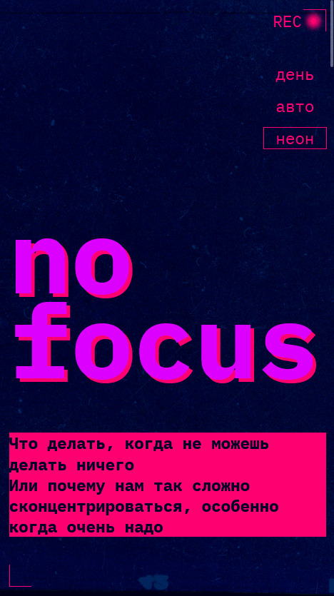

https://github.com/Ibrashka07/slozhno-sosredotochitsya-ad

# Яндекс Практикум, проектная работа "Сложно сосредоточиться"

## Оглавление

- [Макет](#макет)
- [Скриншоты](#скриншоты)
- [Описание](#описание)
- [Автор](#автор)
- [Благодарность](#благодарность)

### Макет
- [Figma](https://www.figma.com/design/AtRv4K5fwqfFZl9avwJuNW/3-спринт.-Проектная-работа?node-id=0-1&p=f&t=JqwqFbJMYTHdkfyx-0)

### Скриншоты

### Описание

Блог, выполненный с адаптивной вёрсткой под мобильный экран, планшет и десктоп. Так же на данном сайте присутствует переключение темы на "темную", "светлую" и авто, по усмотрению пользователя.

## Автор

- Github - [Ibragim Kardanov](https://github.com/Ibrashka07)

## Благодарность

Благодарю команду Яндекс Практикум за предоставление дизайна и уроков!